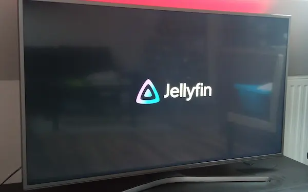

---
tags:
  - selfhost
  - homeserver
  - movie
  - stream
date: 2025-12-19
---

Let's talk about some [awesome selfhosting](https://github.com/awesome-selfhosted/awesome-selfhosted) because it's having a trend now. This post will be more like a TIL than a prose.

## How it started

In the past couple of months, I've got more and more interested in
home servers. My initial interest was towards backing up my family media without
using any proprietary garbage™ software (thanks [tony](https://www.tonybtw.com)).
[Immich](https://immich.app/) flawlessly filled the gap. I packed up all of our
photos and transferred all of them to my little home server.

One day in the morning, I was listening to [The Home Server / Synology Show](https://syntax.fm/show/962/the-home-server-synology-show) from Syntax.fm.
Between the stories of awesome home goodies, I heard about a software called [Jellyfin](https://jellyfin.org/)
that I'd never heard before. So I began with the usual round: traditional
searching & [documentation reading](https://jellyfin.org/docs/). How is it working?
How can it be hosted? What clients does it support? Does it have a good community?

Luckily all lights were green. They even have [support](https://github.com/jellyfin/jellyfin-tizen) for my [old Samsung TV](https://www.displayspecifications.com/en/model/fea6435).
Back in the day, I was - indeed - playing with Tizen applications. It's an
obscure framework that sits below regular Javascript apps.
However, my knowledge has since faded.

## Installation

Fortunately, the good people of the Jellyfin community have a [guide](https://github.com/jellyfin/jellyfin-tizen/wiki/Build-on-Linux) on how to develop.
According to that, we need the [Tizen Studio with the TV SDK](https://developer.samsung.com/smarttv/develop/getting-started/setting-up-sdk/installing-tv-sdk.html). Unfortunately,
only _Ubuntu Linux_ is supported ... and I'm on _Arch_ btw™. Ok, I downloaded both the
_GUI_ and the _CLI_ installer.
The _GUI_ installer couldn't be started because it was missing system `libgtk-2.0`.
So I had to compile and install GTK 2.0 ([AUR](https://aur.archlinux.org/packages/gtk2)).

Upon successfully installing GTK2, I was able to start the GUI installer
(and the _IDE_ itself) but it exclusively uses `apt` to find its dependencies.
So I started working on it with the CLI installer instead.

```sh
# Lists all available packages => OK
./package-manager-cli.bin show-pkgs

# Install the TV extension => NOK missing system packages 
./package-manager-cli.bin install TV-SAMSUNG-Extension-Tools

# Install Certificate extension => NOK missing system packages
./package-manager-cli.bin install cert-add-on --accept-license
```

Problematic dependencies:

- TV extension
- Certificate Manager.

As you can see above, I couldn't install dependencies because
the Package Manager needed `apt`. Well, I was devastated. I hunted
down all libraries and installed them with `pacman` but it was not enough.

Then I found [distrobox](https://github.com/89luca89/distrobox)🎸. It's a cool project that lets you run any
Linux distribution within the terminal. It's essentially running containers
with [podman](https://podman.io/) and mounts the host as a volume.
So I jumped on it and installed Ubuntu on Arch.

```sh
# Install distrobox
sudo pacman -S distrobox podman
# Create Ubuntu container
distrobox create --name tizen-dev --image ubuntu:20.04
# Enter the container
distrobox enter tizen-dev
```

I could install the Samsung dependencies within the container 🎉.
The whole SDK pack could be started now:

- GUI installer ✅
- Emulator ✅
- Certificate Manager ✅
- Certificate profile creation ✅

And in theory, we are done 🏆. Unless...

## Build

Next, clone the _jellyfin-web_ client & create a production build. It had strange [SASS](https://sass-lang.com/) errors but
they magically disappeared.

```sh
cd jellyfin-web
npm ci --no-audit
USE_SYSTEM_FONTS=1 npm run build:production
```

Then clone the _jellyfin-tizen_ client and create a build.

```sh
cd jellyfin-tizen
JELLYFIN_WEB_DIR=../jellyfin-web/dist npm ci --no-audit
```

Now we're supposed to be ready to build a client archive (.wgt).

```sh
# Build a Tizen web project => OK
tizen build-web -e ".*" -e gulpfile.babel.js -e README.md -e "node_modules/*" -e "package*.json" -e "yarn.lock"
# Create an application package for Tizen. => NOK
tizen package -t wgt -o . -- .buildResult
```

The last command was just hanging for eternity without any output or message.
Ok, this was frustrating. No matter how I tried ... it was just not responding.

In one of my desperate moments, I figured out that it relates to the Certificate Manager.
Because it was hanging similarly after I set up _any_ profile. But I couldn't proceed...

The problem was related to the keyring master password. The system
prompt didn't show up. After fixing my Window Manager this was the result:

```txt
The active profile is used for signing. If you want to sign with other profile, please use '--sign' option.
Author certficate: ~/tizen-studio-data/keystore/author/NAME.p12
Distributor1 certificate : ~/tizen-studio/tools/certificate-generator/certificates/distributor/tizen-distributor-signer-new.p12
Excludes File Pattern: {.manifest.tmp, .delta.lst}
Ignore File: ~/Projects/jellyfin-tizen/.buildResult/.manifest.tmp
Package File Location: ~/Projects/jellyfin-tizen/Jellyfin.wgt
```

### Deploy

After solving a couple of networking issues, I proceeded with the following:

```sh
# Get the TV IP
sdb devices
# Connect to the TV
sdb connect $SAMSUNG_TV_IP
# Deploy on TV
tizen install -n Jellyfin.wgt -t $SAMSUNG_TV_NAME 
```

So I could finally deploy my Jellyfin client on the TV.
And magically 🪄 it just works.



### A Community to my rescue

A few hours later, I found [Tim's Github project](https://github.com/Georift/install-jellyfin-tizen) and
[blog post](https://tim.wants.coffee/posts/install-jellyfin-on-a-samsung-tv/).
This awesome tool literally needs one command from start to finish:

```sh
docker run --rm georift/install-jellyfin-tizen $SAMSUNG_TV_IP
```

Tim's project also points to [another cool place](https://github.com/jeppevinkel/jellyfin-tizen-builds/releases) where `Jellyfin.wgt`
archives are built daily 😅.

## References

- https://github.com/jellyfin/jellyfin
- https://github.com/jellyfin/jellyfin-tizen
- https://github.com/Georift/install-jellyfin-tizen
- https://github.com/jeppevinkel/jellyfin-tizen-builds/releases
