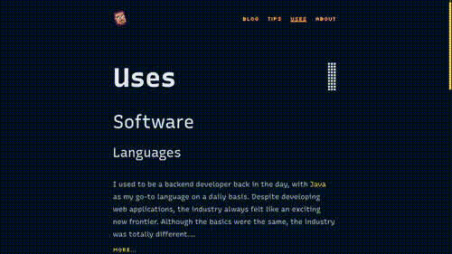

---
tags:
  - css
  - html
  - transition
  - animation
date: 2024-06-21
---
By now, you probably know that I'm obsessed with CSS. These days, CSS is improving rapidly, and it's hard to keep up with every new feature. In this post, I'll provide a basic overview of the new transitions that can make your MPA (Multi-Page Application) site feel like a native application.
## Browser support
I wanted to add this section to the beginning of the post because, as web developers, we generally care about browser features only when they are widely adopted. Unfortunately, the current situation isn't ideal. I'm a heavy Firefox user, and it seems they probably lack the resources (developers) to implement all the RFCs. As more Chromium-based browsers emerge, Firefox loses more market share. Like all browsers, they rely heavily on Google Search for revenue. However, this vicious cycle continues as [fewer and fewer](https://gs.statcounter.com/browser-market-share/) users choose Firefox. The solution? Use Firefox 🦊!
## Display animation
Animating `display` properties has become a [thing](https://developer.mozilla.org/en-US/docs/Web/CSS/display#animating_display). This means we can now animate transitions between `none` and `block`, for example. This is particularly useful in situations like displaying a tooltip, popover, or dialog.

```css
@keyframes fade-in {
  from {
    opacity: 0;
    display: none;
  }

  to {
    opacity: 1;
    display: block;
  }
}

@keyframes fade-out {
  from {
    opacity: 1;
    display: block;
  }
  
  to {
    opacity: 0;
    display: none;
  }
}
```
## Dialog animation
But what if I want to use `transition` instead of `animation`? By doing so, we can let the browser interpolate between the states. Let's see how this works in practice for a dialog.

```css
dialog {
  /* The dialog is hidden. Exit transition end state */
  /* Implicit display: none added */
  opacity: 0;
  transition:
    opacity var(--transition-time) var(--exit-easing),
    overlay var(--transition-time) var(--exit-easing),
    display var(--transition-time) var(--exit-easing) allow-discrete;
}

&[open] {
  /* The dialog is opened. Entry transition end state + exit transition start state */
  /* Implicit display: block added */
  opacity: 1;
  transition:
    opacity var(--transition-time) var(--entry-easing),
    overlay var(--transition-time) var(--entry-easing),
    display var(--transition-time) var(--entry-easing) allow-discrete;
}

/* --> The new thing <-- */
@starting-style {
  /* Entry transition start state */
  dialog[open] {
    opacity: 0;
  }
}
```

The browser will implicitly add the display properties, so we only need to declare the transition. Since `display` is a [discrete property](https://developer.mozilla.org/en-US/docs/Web/CSS/display#formal_definition) (not animatable by default), we have to enable the browser to animate it using `allow-discrete`. This will make the exit animation work.

To make the entry animation work, we need to add the `@starting-style`, which is the initial state. The browser will animate from these starting styles to the end state of the entry animation.

That was a lot 😩. We can still use our good old `animation` property, and that should work as well. With this approach, `display` will be automatically animatable.
## View transition
I have just started working on [view transitions](https://developer.mozilla.org/en-US/docs/Web/API/View_Transitions_API) and I've become obsessed very quickly. I love the native app feeling it brings to the browser, especially in the case of a Multi-Page Application.

Let's see how it works.

```css
@view-transition {
  navigation: auto; 
}
```

And we are done 🤠! Well, we can do more, but that's the gist of it. The browser will capture screenshots (literally) between the two pages. With the rule above, you can opt-in and apply fade transitions between pages.

You don't have to do more than that, but if you want to, you can declare `view-transition-name`s. This will help the browser interpolate between different parts of the UI. For example, let's say you want a different animation for your page titles.

```css
main > h1 {
  /* Create a capture group for my h1 */
  view-transition-name: title;
}

::view-transition-old(title) {
  /* Exit animation */
  animation-duration: var(--view-transition-exit-duration);
  animation-timing-function: linear;
  animation-fill-mode: both;
  animation-name: fade-out;
}

::view-transition-new(title) {
  /* Entry animation */
  animation-duration: var(--view-transition-entry-duration);
  animation-delay: var(--view-transition-exit-duration);
  animation-timing-function: var(--view-transition-entry-function);
  animation-fill-mode: both;
  animation-name: fade-in;
}
```

The browser will construct the following pseudo tree. We can add CSS rules to these elements in the usual way to customize the animation.

```plaintext
::view-transition
└─ ::view-transition-group(title)
   └─ ::view-transition-image-pair(title)
      ├─ ::view-transition-old(title)
      └─ ::view-transition-new(title)
```

Let's try to add another animation for the rest of the page below the title. It will be trickier because there may be different aspect ratios between the screenshots. We don't want to distort them during the transition, so we have to add some extra rules.

```css
main {
  view-transition-name: content;
}

::view-transition-old(content),
::view-transition-new(content) {
  /* Maintain image aspect ratio */
  width: auto;
}

::view-transition-group(content) {
  /* Clip the any overflow as its transitioning between states */
  overflow: clip;
}

::view-transition-old(content) {
  animation-duration: var(--view-transition-exit-duration);
  animation-timing-function: linear;
  animation-fill-mode: both;
  animation-name: fade-out;
}

::view-transition-new(content) {
  animation-duration: var(--view-transition-entry-duration);
  animation-delay: var(--view-transition-exit-duration);
  animation-timing-function: var(--view-transition-entry-function);
  animation-fill-mode: both;
  animation-name: fade-in;
}
```

The pseudo tree will look like the following after the changes. You can see that the `overflow` property is applied to the containing group and not to the children. Therefore, any content that overflows will be clipped during the transition.

```plaintext
::view-transition
└─ ::view-transition-group(title)
   └─ ::view-transition-image-pair(title)
      ├─ ::view-transition-old(title)
      └─ ::view-transition-new(title)
└─ ::view-transition-group(content)
   └─ ::view-transition-image-pair(content)
      ├─ ::view-transition-old(content)
      └─ ::view-transition-new(content)
```

This is very convenient for me: declaring transitions purely in CSS. However, there are situations where we cannot rely solely on CSS selectors because the content is dynamic. Let's explore adding dynamic view transitions. We'll name this transition `fancy` and apply it between pages that have the same `id`.

```js
/* Exit transition. Applied on Page A */
const handlePageSwap = async (e) => {
  /* Compatibility check */
  if (e.viewTransition) {
    document.querySelector(`${id}`).style.viewTransitionName = "fancy";
	/* Remove view-transition-names after snapshots have been taken
	   (this to deal with BFCache) */
    await e.viewTransition.finished;
    document.querySelector(`${id}`).style.viewTransitionName = "none";
  }
};

/* Entry transition. Applied on Page B. */
const handlePageReveal = async (e) => {
  /* Compatibility check */
  if (e.viewTransition) {
    document.querySelector(`${id}`).style.viewTransitionName = "fancy";
	/* Remove names after snapshots have been taken
	    so that we're ready for the next navigation */
    await e.viewTransition.ready;
    document.querySelector(`${id}`).style.viewTransitionName = "none";
  }
};

window.addEventListener("pageswap", handlePageSwap);
window.addEventListener("pagereveal", handlePageReveal);
```

This will overwrite any transition name specified within CSS.
### Wipe transition example
In this chapter, I'd like to create a fancy Star Wars-like transition effect, which you'll probably recognize instantly. It's a wipe effect between two separate scenes. My idea is to have separate masks for the exit and entry transitions in the content view. The screenshots will be stacked on top of each other, and their masks will move synchronously, revealing the clipped parts on opposite sides.

```css
/* Custom CSS property. Its just so cool. */
@property --transition-percentage {
  syntax: "<percentage>";
  inherits: true;
  initial-value: -5%;
}

@keyframes scene-transition {
  to {
    --transition-radius: 105%;
  }
}

:root {
  --view-transition-entry-duration: 2000ms;
  --view-transition-gap: 5%;
  --view-transition-direction: left;
  --view-transition-timing: cubic-bezier(0.65, 0, 0.35, 1);
}

::view-transition-old(content) {
  /* Move the mask from the right to the left ... */
  animation: scene-transition var(--view-transition-entry-duration)
    var(--view-transition-timing) forwards;
  /* ... but hide the right area */
  mask-image: linear-gradient(
    to var(--view-transition-direction),
    transparent calc(var(--transition-percentage) - var(--view-transition-gap)),
    #fff calc(var(--transition-percentage) + var(--view-transition-gap))
  );
}

::view-transition-new(content) {
  /* Move the mask from the right to the left ... */
  animation: scene-transition var(--view-transition-entry-duration)
    var(--view-transition-timing) forwards;
  /* ... but hide the left area */
  mask-image: linear-gradient(
    to var(--view-transition-direction),
    #fff calc(var(--transition-percentage) - var(--view-transition-gap)),
    transparent calc(var(--transition-percentage) + var(--view-transition-gap))
  );
}
```

Check out this detailed article for more information: [Star Wars Scene Transition Effects in CSS](https://codersblock.com/blog/star-wars-scene-transition-effects-in-css/). You can also view my working solution on [GitHub](https://github.com/karesztrk/portfolio/commit/a2e26d3850d82a0fc48aedc1a6c180b16f1b71c9).


## Speculation rules
There's a good chance you want fast view transitions without frustrating users by blocking page transitions until the page is fully loaded. To achieve this, we can either prefetch or prerender the next page.

Google is attempting to assist with the new [Speculation API](https://developer.mozilla.org/en-US/docs/Web/API/Speculation_Rules_API). I haven't tried it yet because it's not functional in Chromium, but the concept is promising: prerender any page that matches a rule. I'll add a real-world example as soon as I can.
```html
<script type="speculationrules">
{
  "prerender": [{
    "where": {
      "and": [
        { "href_matches": "/*" },
        { "not": {"href_matches": "/wp-admin"}},
      ]
    }
  }]
}
</script>
```
## Reference
- https://developer.mozilla.org/en-US/docs/Web/API/View_Transitions_API
- https://jakearchibald.com/2024/view-transitions-handling-aspect-ratio-changes/
- https://developer.chrome.com/docs/web-platform/prerender-pages
- https://github.com/bramus/view-transitions-demos
- https://www.debugbear.com/blog/speculation-rules
- https://developer.chrome.com/docs/web-platform/view-transitions/cross-document
- https://codersblock.com/blog/star-wars-scene-transition-effects-in-css/