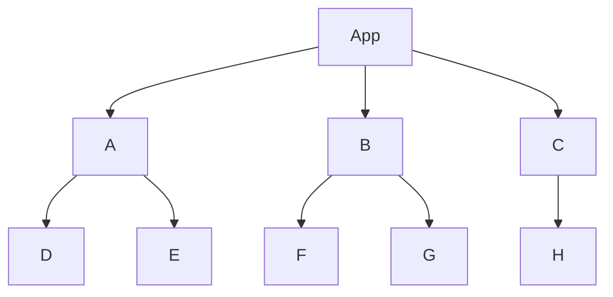

---
tags:
  - presentation
  - slide
date: 2024-05-08
---
️️Hey there, it's been too long! Guess what? I've been diving headfirst into a new project at my company lately. The project is mature and has its own conventions and stack. But you know me—I've always got that developer's eye for improvement. So, naturally, I've been brewing up some killer ideas to take this project to the next level. And what I stumbled upon? A gem of a project called [sli.dev](https://sli.dev/), crafted by none other than [Anthony Fu](https://antfu.me/).
## Installation
The installation process is a breeze, just like setting up any old web application. However, I hit a little snag when it came to getting Firefox to play nice. I simply rolled up my sleeves and tinkered with the scripts until everything fell into place.
```sh
npm init slidev@latest
```
## Features
### Markdown
Taking notes in Markdown? Absolutely! It's practically second nature for us developers these days. But why stop there? When it comes to creating slides, Markdown is where it's at, my friend. And that's where sli.dev swoops in like a superhero! It takes our trusty Markdown and transforms it into sleek, stunning slides that'll knock your socks off. It's like Markdown and slides had a lovechild, and it's beautiful.
```markdown
# Slide 1

My presentation

---

# Slide 2

Say hello world!

# Page 3
```
### Presenter mode
You know, when I first mapped out my presentation, I had this exact thought. I mean, great presenters often have their own notes and layouts, right? It's all about staying organized and on point during the talk. With sli.dev, not only do we get those slick Markdown slides, but we also get our own little slice of presenter paradise. Just fire up `http://localhost:3030/presenter`! You've got your notes and layout right there, ready to keep you in the zone while you work your magic onstage.

### Diagrams
Declarative diagram drawing? Count me in! And let me tell you about [Mermaid](https://mermaid-js.github.io/mermaid). Sure, I might not be a Picasso when it comes to drawing, but with Mermaid, I don't need to be! I recently dipped my toes into creating a flowchart diagram. I could tweak and refine my diagrams right there in my Markdown, no need for any fancy external applications. Mermaid's got that raw power to turn my plain text into polished, professional-looking diagrams.

### Code sharing
And we arrived to the best part! Sharing code examples among fellow devs—it's like our bread and butter, right? No more fussing about with image generators like http://ray.so. [Shiki](https://shiki.style/) and [Twoslash](https://twoslash.netlify.app/) are got our back! With Shiki under the hood, we get top-notch code highlighting that's as easy as pie. Plus, with a treasure trove of predefined themes 💖 to choose from. 
And get this: animating between code changes? It's a walk in the park! sli.dev just keeps on spoiling us with all these nifty features. It's like coding with a magic wand! ✨

````markdown magic-move
````markdown magic-move
```tsx
const arrowFn = () => (
  <span>Hello</span>	
)
```
```tsx
const Component = () => (
  <p>Hello world</p>	
)
```
````
## Conclusion
Oh, but wait, there's more! The feature list for sli.dev just keeps on growing 📈. 
Have I mentioned: 
 - Integrated editor
 - Drawing & Annotations
 - Addons?
 
If you are a dev and looking for a way to have a presentation then drop Office/Open Office and try [sli.dev online](https://sli.dev/new). Say goodbye to the old guard of Office and Open Office—sli.dev is here to revolutionize the way we do presentations. Just head over to [sli.dev/new](https://sli.dev/new). 
## Reference
- https://sli.dev/
- https://shiki.style/
- https://mermaid.js.org/
- https://twoslash.netlify.app/